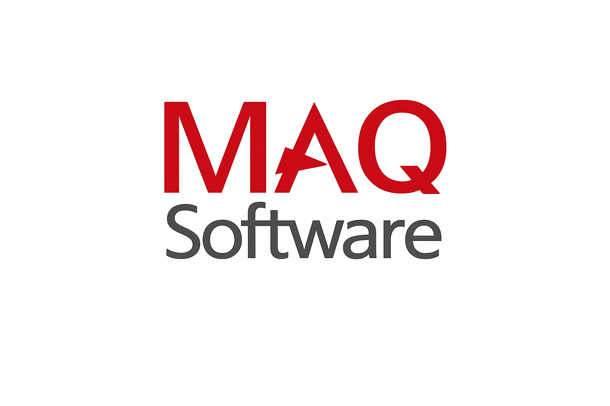

<h1 align="center">Ravi Gangwar</h1>

  Full-Stack Developer | React Native Engineer | AI-Integrated Product Builder

  

  
  
  
  

---

## About

Associate Software Engineer at MAQ Software, currently based in Noida, India.

- Building Azure data and AI automation workflows (ADF, Copilot Studio, Power Automate)
- Built and shipped cross-platform products using React Native, Next.js, and Node.js
- Strong focus on clean architecture, performance, and practical product delivery

---

## Core Stack

  <!-- Replace ravi-gangwar only if you adapt this README for another profile -->
  

---

## Featured Projects

<table>
  <tr>
    <td width="50%" valign="top">
      <h3>WebWatch</h3>
      
Distributed website monitoring with real-time checks and alerting architecture.

      
<strong>Stack:</strong> TypeScript, Redis Streams, RabbitMQ, PostgreSQL, Express, React

      

        <a href="https://github.com/ravi-gangwar/webwatch">Code</a>
      

    </td>
    <td width="50%" valign="top">
      <h3>Salesperson App</h3>
      
Scalable field-sales app with configurable workflows and dynamic forms.

      
<strong>Stack:</strong> React Native (Expo), TypeScript

      

        <a href="https://github.com/ravi-gangwar/salesperson-app">Code</a>
      

    </td>
  </tr>
  <tr>
    <td width="50%" valign="top">
      <h3>Online Code Execution Platform</h3>
      
Secure multi-language execution platform with Docker sandboxing and resource isolation.

      
<strong>Stack:</strong> React, Node.js, Express, Docker, PostgreSQL, AWS

      

        <a href="https://code.ravigangwar.cv">Live</a> |
        <a href="https://github.com/ravi-gangwar/code-editor-frontend">Frontend</a> |
        <a href="https://github.com/ravi-gangwar/code-editor-backend">Backend</a>
      

    </td>
    <td width="50%" valign="top">
      <h3>GuideX Chrome Extension</h3>
      
Automation-focused browser extension for workflow shortcuts and repeat task reduction.

      
<strong>Stack:</strong> React, TypeScript, Chrome Extension API (Manifest V3)

      

        <a href="https://chrome.google.com/webstore/detail/guidex">Chrome Store</a> |
        <a href="https://github.com/ravi-gangwar/guideX">Code</a>
      

    </td>
  </tr>
</table>

---

## Professional Snapshot

<table>
  <tr>
    <td width="44" valign="middle">
      
    </td>
    <td valign="middle">
      <strong>Associate Software Engineer, MAQ Software</strong>
    </td>
  </tr>
</table>
Jan 2025 - Present | Noida, India

- Building data pipelines and transformations on Microsoft Azure
- Developing ETL workflows using Azure Data Factory
- Automating AI-agent workflows using Copilot Studio and Power Automate

<table>
  <tr>
    <td width="44" valign="middle">
      
    </td>
    <td valign="middle">
      <strong>Software Developer, Wyvate</strong>
    </td>
  </tr>
</table>
May 2024 - July 2025 | Remote

- Delivered production customer platform across Android, iOS, and Web
- Improved Node.js + PostgreSQL response latency by around 20%
- Implemented payments, geolocation, deep linking, and realtime communication
- Built AI chatbot flows using OpenAI APIs and MCP-based integrations
- Shipped and maintained app-store releases

Product links:
- Android: https://play.google.com/store/apps/details?id=com.wyvate_native&pcampaignid=web_share
- iOS: https://apps.apple.com/in/app/wyvate/id6740251470
- Web: https://app.wyvate.com

---

## GitHub Metrics

<!-- Replace username if reusing this file -->

  
  

  

  

---

## DSA and Problem Solving

- 500+ solved problems on LeetCode
- 5-star HackerRank in C, JavaScript, and Problem Solving

  <a href="https://leetcode.com/u/ravigangwar/">LeetCode Profile</a> |
  <a href="https://www.hackerrank.com/profile/ravigangwar">HackerRank Profile</a>

---

## Contact

  <a href="mailto:ravigangwar7465@gmail.com">Email</a> |
  <a href="https://www.linkedin.com/in/ravi-gangwar/">LinkedIn</a> |
  <a href="https://github.com/ravi-gangwar">GitHub</a> |
  <a href="https://ravigangwar.cv">Portfolio</a>

Noida, India

---
